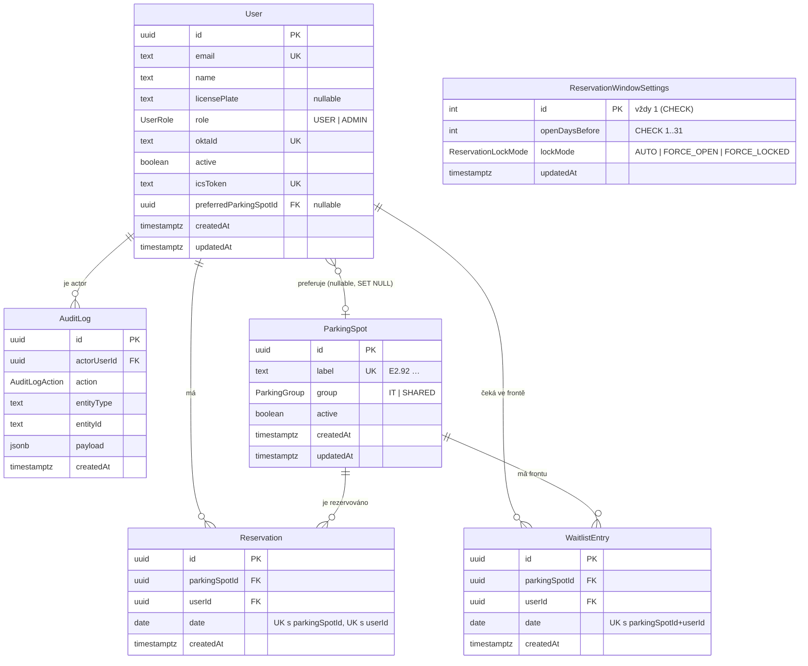

# Databáze – schéma, migrace, seed, zálohy

PostgreSQL 17 + Prisma 7. Všechno databázové žije v `libs/database` (tag `type:data`,
`scope:api`); konfigurace CLI je v `prisma.config.ts` v rootu repa.

Zdroj pravdy pro **tvar dat** je kontrakt (`libs/contract/src/schemas/entities.ts`).
Prisma schéma ho zrcadlí – stejná jména polí, stejná nullabilita, stejné výčty. Kde se
úložiště liší, je to záměr a je to popsané níže v sekci
[Kde se úložiště liší od kontraktu](#kde-se-úložiště-liší-od-kontraktu).

---

## Soubory

| soubor | k čemu je |
| --- | --- |
| `prisma.config.ts` (root) | konfigurace Prisma CLI: cesta ke schématu, k migracím, `DATABASE_URL`, příkaz pro seed |
| `libs/database/prisma/schema.prisma` | doménový model |
| `libs/database/prisma/migrations/` | SQL migrace + `migration_lock.toml` |
| `libs/database/src/generated/prisma/` | **generovaný** Prisma Client (commitnutý, needituje se ručně) |
| `libs/database/src/lib/create-prisma-client.ts` | jediné místo, kde se klient vytváří (driver adapter) |
| `libs/database/src/lib/seed-data.ts` | seed data jako čistá data (testovatelná bez databáze) |
| `libs/database/src/scripts/seed.ts` | skript, který je zapíše (idempotentní) |
| `libs/database/src/index.ts` | veřejný vstup `@lets-park/database` |

`prisma.config.ts` je v rootu proto, že tam Prisma CLI konfiguraci hledá a tam leží
i kořenový `.env` (viz `doc/decision/0009-*`). Prisma 7 už `.env` sama nenačítá –
proto `import 'dotenv/config'` hned na prvním řádku toho souboru.

---

## ERD



`ReservationWindowSettings` v diagramu stojí bokem – nemá vazbu na nic, je to
globální nastavení (viz `doc/decision/0004-*`).

---

## Constrainty, na kterých stojí rezervační logika

Tyhle indexy nejsou optimalizace, ale **byznys pravidla vynucená databází**. Bez nich
je souběžný zápis dvou requestů schopný vytvořit dvojitou rezervaci, ať je aplikační
kód jakkoliv opatrný.

| constraint | co garantuje |
| --- | --- |
| `Reservation (parkingSpotId, date)` UNIQUE | jedno místo na jeden den má nejvýš jednu rezervaci; porušení (`P2002`) mapuje Task 10 na kontraktovou chybu `SPOT_ALREADY_RESERVED` |
| `Reservation (userId, date)` UNIQUE | jeden uživatel má na jeden den nejvýš jednu rezervaci |
| `WaitlistEntry (parkingSpotId, userId, date)` UNIQUE | do stejné fronty se nedá přihlásit dvakrát |
| `User.email`, `User.oktaId`, `User.icsToken` UNIQUE | přihlášení přes Okta i ICS feed musí najít právě jednoho uživatele; `oktaId` je klíč, podle kterého se provisionuje |
| `ParkingSpot.label` UNIQUE | popisek je přirozený klíč místa (a klíč, na který upsertuje seed) |
| `ReservationWindowSettings` `CHECK (id = 1)` | singleton – viz níže |
| `ReservationWindowSettings` `CHECK (openDaysBefore BETWEEN 1 AND 31)` | zrcadlí `MIN_OPEN_DAYS_BEFORE`/`MAX_OPEN_DAYS_BEFORE` z kontraktu |
| trigger `AuditLog_append_only` | `UPDATE`/`DELETE` nad `AuditLog` skončí výjimkou |

Indexy navíc: `Reservation(date)` a `WaitlistEntry(date)` (denní přehled parkoviště),
`WaitlistEntry(parkingSpotId, date, createdAt, id)` (kdo je další ve frontě),
`AuditLog(createdAt)`, `AuditLog(actorUserId)`, `AuditLog(entityType, entityId)`
(filtrování v adminu), `User(preferredParkingSpotId)` (aby `ON DELETE SET NULL`
nemuselo sekvenčně číst celou tabulku).

**Chování cizích klíčů** je explicitní všude, ne default:

- `User.preferredParkingSpotId` → `ON DELETE SET NULL`. Preference je pohodlí, ne
  závazek: zrušení místa nesmí uživatele smazat ani zablokovat.
- všechny ostatní FK → `ON DELETE RESTRICT`. Uživatele ani místo, na které visí
  rezervace nebo audit záznam, nejde smazat; místo mazání se deaktivují
  (`active = false`).

---

## Proč je `date` sloupec typu `DATE`

Rezervační den je kalendářní den v `Europe/Prague`, ne okamžik. `TIMESTAMP` by ho
zakotvil do časové zóny a den by se v závislosti na zóně klienta i serveru posouval –
přesně ta třída chyb, kterou Task 3 celý řešil v `libs/shared-types`
(`doc/decision/0013-kalendarni-aritmetika-a-jedina-hranice-casove-zony.md`).
V kontraktu je to `z.iso.date()` (`YYYY-MM-DD`), v Postgresu `DATE`, a **jediné**
místo, kde se převádí, je servisní vrstva v Tasku 10.

Prisma sloupec `DATE` v TypeScriptu typuje jako `Date` (půlnoc UTC). Test
`schema-contract-parity.spec.ts` proto přímo tvrdí, že storage je `Date` a kontrakt
`string` – aby nikdo nepředal `Date` rovnou do odpovědi typované kontraktem.

---

## Singleton `ReservationWindowSettings`

Tabulka má mít **právě jeden řádek**. Vynucení:

```sql
ALTER TABLE "ReservationWindowSettings"
  ADD CONSTRAINT "ReservationWindowSettings_singleton_check" CHECK ("id" = 1);
```

`id` je `INTEGER` s `DEFAULT 1` a primárním klíčem. Dohromady to dává:
primární klíč zakazuje **druhý** řádek s `id = 1`, `CHECK` zakazuje **jakékoliv jiné**
`id`. Víc než jeden řádek tedy v tabulce být nemůže, a to nezávisle na tom, kdo do ní
píše – aplikace, `psql`, Adminer, budoucí migrace.

**Proč ne jinak:**

- *„Aplikace zapisuje jen jeden řádek."* To není vynucení, to je zvyk. První skript,
  který se splete, tabulku rozdvojí a čtení začne vracet náhodný řádek.
- *Partial unique index* (`CREATE UNIQUE INDEX … ON t ((true))`) funguje taky, ale je
  to okluznější zápis téhož a Prisma ho ve schématu neumí vyjádřit o nic líp.
- *`@@unique` nad konstantním sloupcem* by znamenal sloupec navíc, který nic neznamená.

**Proč `id` není UUID.** `doc/decision/0016-*` říká, že identifikátory **entit** jsou
UUID, protože chodí v URL a v realtime payloadech. Tenhle `id` nikam nechodí:
`reservationWindowSettingsSchema` v kontraktu žádné `id` nemá, API čte a zapisuje
nastavení bez identifikátoru. Fixní `1` je tedy interní detail úložiště, ne porušení
0016 – a je to jediná varianta, ve které `CHECK` může být tak triviální.

Řádek zakládá **migrace**, ne seed (`INSERT … ON CONFLICT DO NOTHING` na konci
`migration.sql`). Tabulka totiž nesmí být nikdy prázdná – čte ji každá rezervační
cesta – a `prisma db seed` se v produkci nepouští. Seed hodnoty pro jistotu ještě
upsertuje, aby se ručně rozhrabaná dev databáze vrátila do známého stavu.

Podrobněji: `doc/decision/0023-singleton-nastaveni-vynuceny-check-constraintem.md`.

---

## Hard delete + `AuditLog` místo soft delete

Zrušení rezervace **maže řádek** a zapisuje záznam do `AuditLog`. Soft delete
(`deletedAt`) se nepoužívá.

**Proč:**

1. **Unikátní index musí platit.** `Reservation (parkingSpotId, date)` je to jediné, co
   brání dvojité rezervaci. Se soft delete by v tabulce zůstal „zrušený" řádek a index
   by na to místo ten den už nikoho nepustil. Šlo by to obejít částečným indexem
   (`WHERE "deletedAt" IS NULL`), ale tím se z jednoduché garance stává něco, co musí
   mít každý dotaz na paměti — a co jednou někdo zapomene.
2. **Každý dotaz by musel filtrovat.** „Kdo dnes parkuje" se ptá na živé rezervace.
   Soft delete přidává `WHERE "deletedAt" IS NULL` do každého dotazu, joinu i agregace;
   jedno zapomenuté místo znamená tichou chybu v datech, ne pád.
3. **Historii stejně potřebujeme jinde.** Audit má odpovídat na „kdo, co, kdy a s jakým
   payloadem", tedy i na akce, které žádný řádek nemažou (`USER_UPDATED`,
   `SPOT_UPDATED`, `WAITLIST_PROMOTED`). `AuditLog` to umí celé; soft delete pokrývá
   jen mazání, takže by se vedle auditu udržoval druhý, poloviční záznam historie.
4. **Mazání smí být skutečné jen tam, kde je bezpečné.** Uživatelé ani místa se
   nemažou vůbec – deaktivují se (`active = false`), právě aby FK a audit zůstaly
   platné. Hard delete se týká jen rezervací a položek fronty, což jsou krátkodobé,
   datem ohraničené záznamy.

**`AuditLog` je proto append-only** a je to vynucené databází, ne konvencí:

```sql
CREATE TRIGGER "AuditLog_append_only"
  BEFORE UPDATE OR DELETE ON "AuditLog"
  FOR EACH ROW EXECUTE FUNCTION "auditlog_reject_mutation"();
```

Funkce vyhodí výjimku s `ERRCODE = 'restrict_violation'`. Konvence by tady nestačila:
audit je jediný záznam o tom, že rezervace vůbec existovala, takže omylem spuštěný
`UPDATE` ničí důkaz, který se nemá odkud obnovit — a k tabulce se dá dostat i mimo
aplikaci. Trigger to zastaví ve všech případech.

Cena: opravit překlep v `payload` nejde – jde jen připsat nový záznam. To je záměr.

Podrobněji: `doc/decision/0024-hard-delete-a-append-only-auditlog.md`.

---

## Kde se úložiště liší od kontraktu

Všechno ostatní je 1:1 (a hlídá to `libs/database/src/lib/schema-contract-parity.spec.ts`).

| pole | kontrakt (drát) | úložiště | proč |
| --- | --- | --- | --- |
| `AuditLog.payload` | `Record<string, unknown>` | `JSONB` (`Prisma.JsonValue`) | tvar payloadu závisí na `action`; strukturovaný sloupec by musel být union šesti tvarů. `JsonValue` navíc připouští JSON hodnotu `null`, i když sloupec je `NOT NULL` – to je vlastnost JSONu, ne nullable sloupec |
| `Reservation.date`, `WaitlistEntry.date` | `string` (`YYYY-MM-DD`) | `DATE` → `Date` | viz sekce o `DATE` výše |
| `*.createdAt`, `*.updatedAt` | `string` (ISO 8601, `doc/decision/0015-*`) | `TIMESTAMPTZ(3)` → `Date` | kontrakt je transport-neutrální; databáze ukládá okamžik včetně zóny |
| `ReservationWindowSettings.id`, `.updatedAt` | neexistuje | `INTEGER` / `TIMESTAMPTZ(3)` | singleton se přes API neadresuje – viz sekce výše |
| `User.role`, `ParkingSpot.active`, … | bez defaultu | s `DEFAULT` | defaulty v databázi jsou pojistka, hodnoty se nemění |

Identifikátory jsou **UUID v7** (`@default(uuid(7))`, sloupec `UUID`). Kontrakt verzi
nevynucuje (`z.uuid()`, `doc/decision/0016-*`), v7 je zvolené kvůli monotónnímu
prefixu – zápis na primární klíč má lepší lokalitu než náhodná v4. Generuje je Prisma
Client, ne databáze; ruční `INSERT` v SQL proto musí `id` dodat sám (dělá to i seed
řádek v migraci, jen tam je `id` fixní jednička).
Podrobněji: `doc/decision/0022-uuid-v7-jako-primarni-klic.md`.

---

## Jak se to pouští

Předpoklad: běží `postgres` z `docker-compose.yml` a v rootu je `.env` s
`DATABASE_URL` (viz `doc/prostredi.md`).

```bash
docker compose up -d postgres
cp .env.example .env      # jednou
```

Všechny příkazy se pouští **z rootu repa** – `prisma.config.ts` si cesty do
`libs/database` dohledá sama.

| příkaz | co dělá |
| --- | --- |
| `npx prisma validate` | ověří schéma (bez databáze) |
| `npx prisma format` | naformátuje `schema.prisma` (bez databáze) |
| `npx prisma generate` | přegeneruje klienta do `libs/database/src/generated/prisma` (bez databáze) |
| `npx prisma migrate dev --name <jmeno>` | dev: vytvoří novou migraci a aplikuje ji |
| `npx prisma migrate deploy` | produkce/CI: aplikuje existující migrace, nic negeneruje |
| `npx prisma migrate status` | co je aplikované a co chybí |
| `npx prisma db seed` | spustí `libs/database/src/scripts/seed.ts` |
| `npx prisma studio` | prohlížeč dat (dev) |

Typický první běh:

```bash
npx prisma migrate deploy
npx prisma db seed
```

### Past: ručně psané SQL a `migrate dev`

Konec `migration.sql` obsahuje SQL, které Prisma ze schématu neumí odvodit
(`CHECK` constrainty, trigger, `INSERT` singletonu). `prisma migrate dev` porovnává
stav po aplikaci migrací proti `schema.prisma`, takže tyhle objekty vidí jako „drift"
a do nové migrace by navrhl jejich **zrušení**.

Postup při každé další změně schématu:

```bash
npx prisma migrate dev --create-only --name <jmeno>   # jen vygeneruje SQL
# → otevři vygenerovaný migration.sql a smaž z něj případné
#   DROP CONSTRAINT ...singleton_check / ...range_check / DROP TRIGGER
npx prisma migrate dev                                 # teď to aplikuj
```

Když se ručně psané SQL někdy rozroste, je alternativou přesunout ho do samostatné
„always-run" migrace; dokud jsou to tři objekty, je tenhle postup levnější než další
vrstva nástrojů.

### Seed

Seed je **idempotentní** – každý zápis je `upsert` na přirozený klíč (`label`,
`email`, `id = 1`), nic nemaže. Dá se pustit opakovaně i nad částečně naplněnou
databází.

Co zakládá:

- **Parkovací místa** podle reálného layoutu: `E2.92`–`E2.95` (skupina `IT`),
  `E2.96`, `E2.65`, `E2.66`, `E2.61`, `E2.62` (skupina `SHARED`).
- **Dev uživatele** `admin@example.com` (ADMIN), `user@example.com`,
  `user2@example.com` a `inactive@example.com` (deaktivovaný, kvůli testování
  offboardingu). Adresy jsou schválně na `example.com` – v repu nesmí být nic, co
  vypadá jako skutečná identita (stejná konvence jako v `.env.example`).
- **Nastavení rezervačního okna** `openDaysBefore = 7`, `lockMode = AUTO`.

Rezervace ani položky fronty se neseedují: jsou vázané na datum a v okamžiku, kdy je
někdo spustí, by už byly v minulosti.

**Jak se přihlásit za seedovaného uživatele.** `mock-oauth2-server` běží bez
namountovaného `JSON_CONFIG`, takže jeho přihlašovací formulář přijme libovolný
`sub`. Pole `oktaId` v seedu je hodnota, kterou má vývojář do formuláře napsat, aby
padl na konkrétní účet: `dev-admin`, `dev-user`, `dev-user-2`, `dev-inactive`.
Až Task 12 doplní provisioning, bude tohle jediná vazba mezi mock OIDC a databází.

---

## Zálohy

Jednoinstanční nasazení, žádný managed backup – záloha je `pg_dump`.

```bash
# plná záloha (custom formát, komprimovaný; nejlepší pro pg_restore)
pg_dump "$DATABASE_URL" --format=custom --file=lets-park-$(date +%F).dump

# jen data, bez schématu (schéma umí obnovit migrace)
pg_dump "$DATABASE_URL" --format=custom --data-only --file=lets-park-data-$(date +%F).dump

# obnova do prázdné databáze
pg_restore --dbname="$DATABASE_URL" --clean --if-exists lets-park-2026-08-28.dump
```

Z běžícího kontejneru bez lokálního `pg_dump`:

```bash
docker compose exec -T postgres pg_dump -U "$POSTGRES_USER" -d "$POSTGRES_DB" \
  --format=custom > lets-park-$(date +%F).dump
```

Poznámky:

- Obnovujte do databáze, kde už proběhlo `prisma migrate deploy`, a použijte
  `--data-only`; jinak se `pg_restore` pere s existujícím schématem.
- Trigger `AuditLog_append_only` **nebrání** obnově: `pg_restore` dělá `INSERT`/`COPY`,
  ne `UPDATE`.
- Tabulka `_prisma_migrations` je součástí dumpu. Při plné obnově se tím přenese
  i historie migrací, což je žádoucí.
